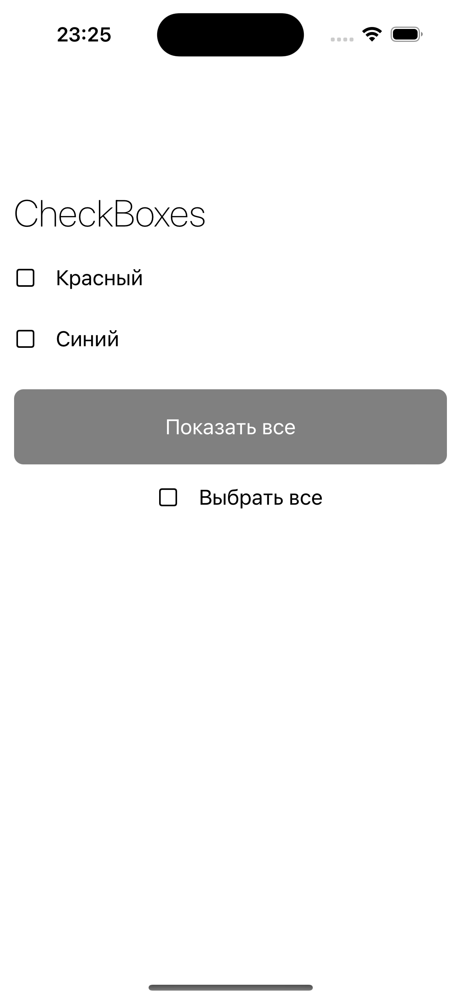
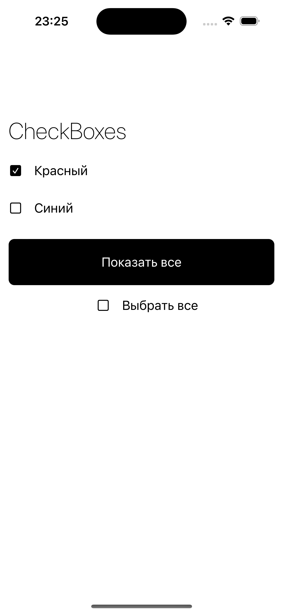
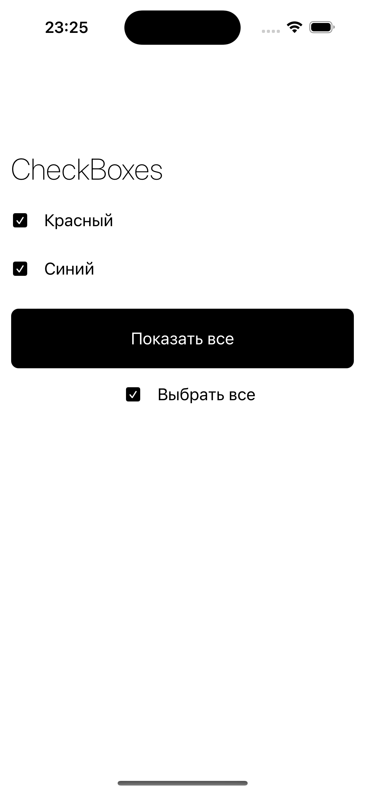

# CheckboxApp

## Обзор

Этот проект представляет собой простое iOS-приложение, демонстрирующее использование  checkbox в пользовательском интерфейсе с интеграцией RxSwift для реактивного программирования. Приложение загружает данные из JSON-файла, отображает их в виде списка флажков и предоставляет функциональность для одновременного выбора или снятия выбора со всех флажков.





## Функционал

- **Загрузка данных:** Приложение загружает категории из локального JSON-файла и отображает их в виде флажков.
- **Взаимодействие с флажками:** Каждый checkbox можно переключать индивидуально.
- **Взаимодействие с кнопка:** Изначально деактивирована, если отметить все checkbox, которые имею поле **required = true**, то кнопка становится активна и меняет цвет. Добавлена анимация на нажатие. ы
- **Выбрать все:** Кнопка "Выбрать все" позволяет одновременно переключить все checkbox, у которых поле **tapped_on_select_all = true**
- **Условные обновления UI:** Состояния кнопок и checkbox обновляются в зависимости от взаимодействия пользователя.

## Установка

1. **Клонируйте репозиторий:**
   ```bash
   git clone https://github.com/yourusername/checkbox-app.git
2. **Откройте проект:**
    Откройте проект в Xcode, дважды щелкнув на CheckboxApp.xcodeproj.

3. **Запустите приложение:**
Выберите симулятор или подключенное устройство и нажмите кнопку "Run" в Xcode.

**Структура проекта**

- **DataLoader.swift:** Обрабатывает загрузку и декодирование данных из локального JSON-файла.
- **CheckboxButton.swift:** Пользовательский класс кнопки для отдельных флажков с привязками RxSwift.
- **CheckboxAllButton.swift:** Пользовательский класс кнопки для функциональности "Выбрать все".
- **MainViewController.swift:** Основной контроллер представления, который управляет UI и связывает данные с RxSwift.
- **MainViewModel.swift:** Модель представления, которая обрабатывает бизнес-логику и загрузку данных.
- **MainModel.swift:** Модель данных для категорий.
- **Coordinator.swift:** Базовые и главные координаторы для управления навигацией.
- **SceneDelegate.swift:** Конфигурирует окно приложения и запускает основной координатор.

 **Использование**

Добавьте данные: Обновите файл data.json в пакете проекта вашими данными. Пример данных JSON:

   ```bash
[
    {
        "id": 1,
        "title": "Красный",
        "required": true,
        "tapped_on_select_all": true
    },
    {
        "id": 2,
        "title": "Синий",
        "required": false,
        "tapped_on_select_all": true
    }
]
 ```

**Запуск приложения:**

 Когда вы запустите приложение, оно:

- Загрузит данные из файла data.json.
- Отобразит каждую категорию в виде чекбокса.
- Предоставит чекбокс для одновременного переключения всех чекбоксов.
- Обновит состояние кнопки в зависимости от того, выбраны ли все необходимые флажки.

**Зависимости**
- RxSwift: Для реактивного программирования и привязки данных.
- RxCocoa: Для интеграции RxSwift с UIKit.